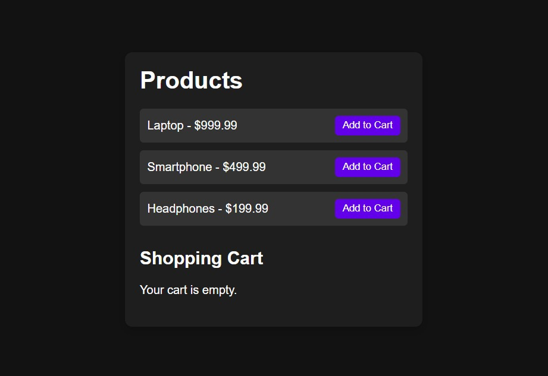

# EcommerceApp 🚀

**EcommerceApp** is a small, front-end e-commerce demo built with plain **HTML**, **CSS**, and **JavaScript**. It demonstrates a simple product listing, add-to-cart interaction, and a lightweight cart summary — great for learning or as a starter template.

---

## 📸 Screenshot



> Replace the placeholder image in `./assets/FinalView.png` with your real screenshot (for example: `assets/screenshot.png`).

---

## ✨ Features

- Product listing (static data)
- Add to cart + cart summary
- Responsive layout (basic)
- Built with vanilla JavaScript (no frameworks)

---

## 🛠️ Tech Stack

- HTML
- CSS
- JavaScript

---

## ▶️ Run Locally

1. Clone or download the repository.
2. Open `index.html` in your browser, or run a local server (recommended):

```bash
# using Python 3
python -m http.server 8000
# then open http://localhost:8000
```

3. The app will load from `index.html`.

---

## 📁 Project Structure

```
index.html        # main HTML file
styles.css        # stylesheet
script.js         # app logic
README.md         # this file
screenshots/      # project screenshots (add your own here)
```

---

## 🤝 Contributing

Contributions are welcome. To update the screenshot, place an image named `screenshot.png` (or `.jpg`) in the `screenshots` folder and update this README if needed.
